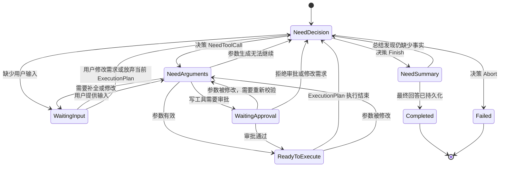
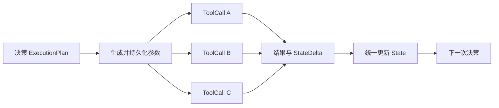

# LLM-Driven Runtime

一个使用 Rust 编写、由 LLM 驱动任务决策和工具编排的实验性 Runtime（运行时）。

项目目标是构建一个可持久化、可恢复、支持阶段内并行工具调用的任务运行时。LLM 负责语义决策和参数生成，Runtime 负责校验、调度、执行、一致性和状态推进。

> 项目目前处于架构演进阶段。仓库中的代码仍是单工具调用原型，`docs/architecture/` 描述的是准备逐步实现的目标架构。

## 核心模型

一个用户任务称为 Task。Task 通过多个持久化 Phase（运行阶段）逐步推进；一次 `Runtime::handle` 只处理一个 Phase。



决策 Phase 可以产生一个 ExecutionPlan。ExecutionPlan 包含一组相互独立、可以并行执行的 ToolCall：



## 设计原则

- 一次 `Runtime::handle` 只推进一个持久化 Phase。
- 决策、参数生成、工具执行和最终总结分别持久化。
- 已持久化的 LLM 输出不重复生成。
- 已成功的 ToolCall 不重复执行。
- ExecutionPlan 中只允许相互独立的 ToolCall 并行运行。
- ToolCall 不直接修改共享 State，只返回结构化结果和 `StateDelta`。
- ExecutionPlan 结束后统一、确定性地合并 StateDelta。
- ExecutionPlan 部分失败时保留成功结果，并由下一次 LLM 决策如何继续。
- 队列采用 at-least-once（至少一次）语义，写工具通过幂等键避免重复副作用。
- 数据库是唯一事实来源，内存队列只负责调度和背压。

## 当前实现

当前代码已经具备：

- `Runtime` 的单工具选择、参数生成和执行链路。
- `Tool` trait（特征）和工具注册表。
- 测试工具使用 `schemars` 生成参数 Schema。
- 集成测试使用固定工具选择器和固定参数生成器验证 Runtime 链路。
- 旧 Runtime 的集成测试使用参数回显 fixture 验证工具选择、参数传递和错误传播。
- `PhaseRuntime` 的集成测试覆盖决策映射、并行安全校验和原子提交。

目标架构中尚未实现的主要能力包括：

- Task、Phase、ExecutionPlan 和 ToolCall 持久化模型。
- 一次 `handle` 只推进一个 Phase 的状态机。
- ExecutionPlan 内有界并行工具执行。
- StateDelta 的统一应用和 StateReducer。
- 数据库 Repository、事务、Lease 和崩溃恢复。
- 有界任务队列、Dispatcher 和 Worker Pool。
- 工具重试、幂等和资源限制。
- 真实 LLM Adapter。
- 人工补参和写工具审批。

具体实施顺序见[实施计划](docs/architecture/implementation-plan.md)。

## 架构文档

| 文档 | 内容 |
| --- | --- |
| [架构总览](docs/architecture/README.md) | 项目目标、核心概念、总体架构和架构不变量。 |
| [Runtime 运行模型](docs/architecture/runtime-model.md) | `Runtime::handle`、Task Phase 状态机以及各 Phase 的职责。 |
| [调度模型](docs/architecture/scheduling.md) | 有界队列、Dispatcher、Worker、Lease 和背压。 |
| [工具执行模型](docs/architecture/tool-execution.md) | ToolCall、ExecutionPlan 并行、参数、重试、幂等和 StateDelta。 |
| [持久化与恢复](docs/architecture/persistence-and-recovery.md) | 数据模型、事务边界、一致性和崩溃恢复。 |
| [运行保障](docs/architecture/operations.md) | 资源控制、失败语义、可观测性和安全。 |
| [实施计划](docs/architecture/implementation-plan.md) | 迁移顺序、里程碑、测试策略和待决策项。 |

## 开发约定

[测试编写约定](docs/testing.md)说明单元测试与集成测试的归属、测试函数命名和注释、场景去重、fixture 边界及提交前验证命令。

## 快速验证

项目使用 Rust 2024 edition。安装 Rust stable 工具链后，在仓库根目录运行：

```bash
cargo fmt --all -- --check
cargo test --workspace
cargo clippy --workspace --all-targets -- -D warnings
```

当前 `main` 仍是占位入口，项目行为主要通过集成测试和单元测试验证。

## 目录结构

| 路径 | 用途 |
| --- | --- |
| `src/runtime.rs` | 当前 Runtime 原型。 |
| `src/state.rs` | State、StateDelta 和状态合并相关类型。 |
| `src/tool/` | Tool 契约、工具注册表、选择器和参数生成器接口。 |
| `tool-macros/` | 工具参数 Schema 过程宏，当前由测试工具使用。 |
| `tests/` | Runtime、工具契约和测试工具的集成测试。 |
| `docs/architecture/` | 目标架构与实施计划。 |

## 后续开发

后续实现以[架构总览中的不变量](docs/architecture/README.md#8-架构不变量)为约束，并按[实施计划](docs/architecture/implementation-plan.md)逐个里程碑推进。

每个里程碑开始前先确认对应决策门，再修改代码；架构契约发生变化时，应同时更新相应文档。
