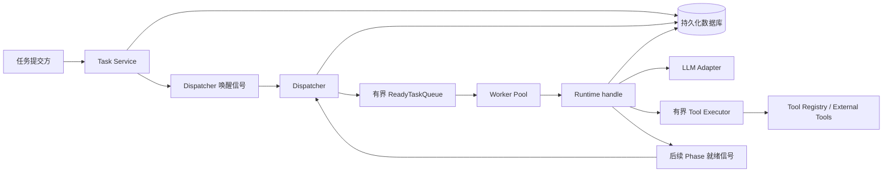

# LLM-Driven Runtime 架构总览

## 1. 文档说明

本目录描述 LLM-Driven Runtime 的目标架构、核心运行模型、持久化边界、一致性语义和实施计划。

架构当前状态为 **提案**。它用于统一后续实现方向，不代表所有接口和数据表已经最终定型。

## 2. 背景

当前 `Runtime::handle` 在一次调用中依次完成工具选择、参数生成和单个工具执行，执行成功后直接返回工具结果。这个模型适合验证最小链路，但存在以下限制：

- 一次只能执行一个工具，无法表达同一阶段的并行工具调用。
- 工具选择、参数生成和工具执行没有独立的持久化边界。
- 进程崩溃或任务重新调度后，LLM 可能重复生成已经生成过的内容。
- 工具执行结果没有以结构化方式描述它将如何改变 `State`。
- 缺少任务队列、背压、重试、租约和崩溃恢复机制。
- 缺少等待用户补全参数和审批写工具的暂停状态。

目标架构将 Runtime 设计为一个持久化的、分阶段推进的任务运行时。

## 3. 已确定的架构决策

1. 一次 `Runtime::handle` 只处理一个持久化 Phase，不在一次调用中完成整个用户任务。
2. 工具决策、参数生成、工具执行和最终总结是不同的 Phase。
3. 一个 Stage 可以包含多个相互独立、可以并行执行的 ToolCall。
4. 执行 Phase 可以在 Rust 异步任务中 `await` 当前 Stage 的工具执行，不要求完全采用 Netty 式回调模型。
5. 每个 ToolCall 完成后立即持久化结果和 `StateDelta`，但不直接修改共享 `State`。
6. Stage 中的 ToolCall 全部到达终态后，Runtime 统一合并结果并一次性更新 `State`。
7. Stage 部分成功时，保留成功 ToolCall 的结果和状态变化，同时记录失败事实。
8. ToolCall 是否重试以及可以重试多少次，由工具的重试策略决定。
9. ToolCall 重试耗尽意味着 Stage 执行失败，不直接意味着整个 Task 失败；下一次由 LLM 决定如何继续。
10. 队列采用 at-least-once（至少一次）投递语义，写工具通过幂等键避免重复副作用。
11. 已经成功持久化的 LLM 输出不再重新生成，已经成功持久化的 ToolCall 结果不再重新执行。
12. 人工参与包括补全或修改参数、审批写工具。第一版保留状态和数据结构，但不要求实现完整交互。

## 4. 目标与非目标

### 4.1 目标

- 支持一个用户任务经过多个持久化 Phase 逐步完成。
- 支持同一 Stage 内多个 ToolCall 有界并行执行。
- 支持进程重启、Worker 崩溃和重复队列消息下的任务恢复。
- 避免重复生成已经持久化的 LLM 内容。
- 通过幂等机制避免写工具产生重复业务副作用。
- 让每次决策、参数、执行结果和状态变化可以审计。
- 为人工补参、修改参数和审批写工具保留扩展点。
- 对任务、LLM 和工具执行设置资源上限，避免无限运行。

### 4.2 第一版非目标

- 不保证所有外部工具调用严格 exactly-once（恰好一次）。
- 不实现分布式事务或自动补偿所有外部副作用。
- 不实现完整的人工交互界面和审批工作流。
- 不在第一版实现任意依赖图调度；Stage 内只允许无相互依赖的 ToolCall。
- 不要求第一版支持动态扩缩容和跨区域调度。

## 5. 核心概念

| 概念 | 含义 |
| --- | --- |
| Task | 一次需要 Runtime 持续推进的用户任务，是持久化和调度的顶层单位。 |
| Phase | Task 当前需要处理的运行阶段；一次 `handle` 只处理一个 Phase。 |
| Stage | LLM 在决策 Phase 中产生的一组可并行工具意图。 |
| ToolCall | 工具名称、持久化参数、执行状态、结果和幂等信息组成的一次逻辑调用。 |
| State | Runtime 对当前任务已知事实、业务知识、执行历史和进度的持久化表示。 |
| StateDelta | ToolCall 成功后建议对 State 进行的结构化变更，不由工具直接应用。 |
| StateReducer | 校验、合并并应用一组 StateDelta 的确定性组件。 |
| Dispatcher | 根据数据库中的可运行任务和本地队列容量认领任务的调度器。 |
| Worker | 从有界队列消费任务并调用 `Runtime::handle` 的执行单元。 |
| Lease | 带过期时间的任务认领记录，用于崩溃恢复。 |

## 6. 总体架构

数据库是任务状态的唯一事实来源。内存中的有界队列只承担低延迟调度和背压，不承担可靠存储职责。

## 7. 文档导航

| 文档 | 内容 |
| --- | --- |
| [运行模型](runtime-model.md) | `Runtime::handle`、Task Phase 状态机以及各 Phase 的输入和输出。 |
| [调度模型](scheduling.md) | 有界队列、Dispatcher、Worker、Lease 和背压。 |
| [工具执行](tool-execution.md) | ToolCall、Stage 并行、参数、重试、幂等、StateDelta 和人工参与。 |
| [持久化与恢复](persistence-and-recovery.md) | 逻辑数据模型、事务边界、一致性与崩溃恢复。 |
| [运行保障](operations.md) | 资源控制、失败语义、可观测性和安全。 |
| [实施计划](implementation-plan.md) | 迁移顺序、里程碑、测试策略和待决策项。 |

## 8. 架构不变量

1. 一次 `handle` 只推进一个 Phase。
2. Phase 的关键输出必须先持久化，才能推进下一 Phase。
3. 数据库是唯一事实来源，内存队列不保存不可恢复的唯一状态。
4. 已持久化的 LLM 输出不重新生成。
5. 已成功的 ToolCall 不重新执行。
6. 写工具恢复执行时使用相同幂等键。
7. ToolCall 不直接修改共享 State。
8. Stage 完成后统一、确定性地合并 StateDelta。
9. Stage 部分失败时不丢弃已经成功的事实和状态变化。
10. Stage 失败不自动等同于 Task 失败。
11. 等待用户输入或审批的 Task 不被自动调度。
12. 重复队列消息和过期 Lease 不得造成重复 Phase 提交。

