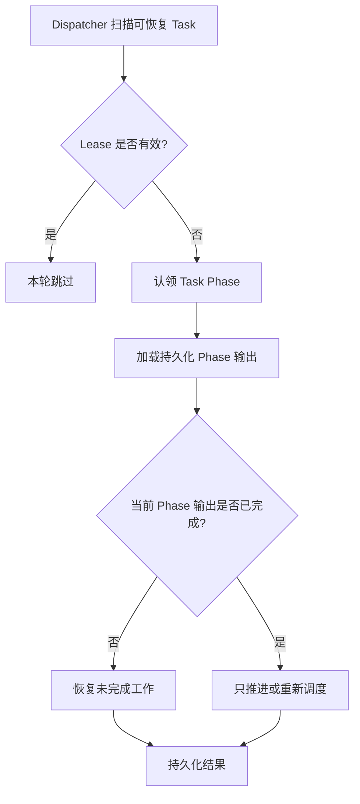

# 持久化与恢复

## 1. 持久化原则

数据库是 Task、Phase、Stage、ToolCall 和 State 的唯一事实来源。

关键原则：

- Task 必须先持久化再进入队列。
- 每个 Phase 的关键输出必须先持久化再推进状态。
- 已持久化输出是恢复时的完成凭证。
- 内存中的 Task、State 和队列项都可以丢失并从数据库重建。
- 外部工具副作用不能依赖数据库事务保证原子性，必须使用幂等和恢复策略。

下面的数据模型是逻辑模型，不限定具体数据库、ORM 和字段存储格式。

## 2. Task

建议字段：

| 字段 | 用途 |
| --- | --- |
| `id` | Task 唯一标识。 |
| `phase` | 当前持久化 Phase。 |
| `scheduling_status` | Ready、Queued、Running、Suspended 或 Terminal。 |
| `state` | 当前 State 的结构化内容。 |
| `state_version` | State 乐观锁版本。 |
| `phase_version` | 识别重复队列消息和并发推进。 |
| `lease_owner` | 当前认领者。 |
| `lease_expires_at` | Lease 过期时间。 |
| `next_run_at` | 下次允许调度时间。 |
| `created_at`、`updated_at` | 审计时间。 |

`phase_version` 在每次 Phase 成功迁移时单调递增。`state_version` 只在 State 成功提交时递增。

## 3. Stage

建议字段：

| 字段 | 用途 |
| --- | --- |
| `id` | Stage 唯一标识。 |
| `task_id` | 所属 Task。 |
| `ordinal` | Task 内的 Stage 顺序。 |
| `state_version` | 决策时使用的 State 版本。 |
| `decision` | 已持久化的 LLM 决策原始输出和解析结果。 |
| `status` | Planned、Ready、Running、Succeeded、Failed 或 Conflict。 |
| `created_at`、`completed_at` | 审计时间。 |

Stage 必须记录决策时使用的 State 版本。参数生成和工具执行发现 State 已被其他流程修改时，不得静默继续使用过期快照。

## 4. ToolCall

建议字段：

| 字段 | 用途 |
| --- | --- |
| `id` | ToolCall 唯一标识。 |
| `stage_id` | 所属 Stage。 |
| `call_key` | Stage 内稳定逻辑标识。 |
| `tool_name` | 工具名称。 |
| `purpose` | 决策阶段描述的调用目的。 |
| `argument_revision` | 参数修订版本。 |
| `arguments` | 已校验的结构化参数。 |
| `status` | 参数和执行状态。 |
| `attempt` | 已执行次数。 |
| `next_retry_at` | 下次允许重试时间。 |
| `idempotency_key` | 写工具幂等键。 |
| `result` | 结构化工具结果。 |
| `state_delta` | 工具建议的 State 变化。 |
| `error` | 最终或最近一次错误。 |
| `started_at`、`completed_at` | 审计时间。 |

建议建立以下唯一约束：

- `(stage_id, call_key)` 唯一。
- `(tool_name, idempotency_key)` 在需要幂等的工具调用范围内唯一。
- 同一个 ToolCall 同一时间只有一个有效参数 revision。

ToolCall 的逻辑状态至少需要区分：参数待生成、参数有效、等待审批、待执行、执行中、等待重试、成功、失败和执行结果未知。

## 5. FinalResponse

最终回答应单独持久化或作为 Task 的不可变完成字段持久化，至少保存：

- `task_id`
- `state_version`
- LLM 原始输出
- 对用户展示的最终内容
- 生成时间

FinalResponse 持久化和 Task 进入 `Completed` 必须在同一事务中完成。

## 6. State

State 至少包含：

- 用户目标和有效输入。
- 当前任务已经确认的事实。
- 当前任务需要的业务知识。
- 已执行 Stage 和 ToolCall 的结构化结果。
- 失败、重试耗尽和无法确定的执行事实。
- 当前业务目标的完成进度。
- 等待用户补充或审批的信息。

State 可以作为结构化快照保存，同时保留 Stage、ToolCall 和 StateDelta 作为审计与重建依据。State 的具体类型见[实施计划中的待决策项](implementation-plan.md#12-实现前待决策项)。

## 7. 事务边界

以下操作必须具有原子性：

1. 创建 Task 并设置初始 Phase。
2. 持久化决策结果、创建 Stage 和 PlannedToolCall、推进到参数 Phase。
3. 持久化单个 ToolCall 参数及其 revision。
4. 持久化单个 ToolCall 的一次执行结果或错误及 attempt。
5. 合并 Stage 结果、更新 State、更新 Stage 状态、推进 Task Phase。
6. 持久化最终回答并将 Task 标记为 Completed。

外部工具调用不能与本地数据库事务组成普遍可靠的原子事务，因此不包含在上述事务中。

## 8. 并发控制

### 8.1 Phase CAS

Worker 使用 `task_id`、`expected_phase` 和 `expected_version` 原子认领 Phase。更新影响行数为零表示任务已经被其他 Worker 推进，当前 job 返回 `Stale`。

### 8.2 State 乐观锁

StateReducer 提交时必须验证 Stage 使用的 `state_version`。版本不匹配时不得覆盖新 State，应记录冲突并重新决策。

### 8.3 ToolCall 结果提交

ToolCall 结果提交必须验证调用状态、attempt 和参数 revision。迟到的旧 attempt 不能覆盖新 attempt 或新参数 revision 的结果。

## 9. 恢复流程

恢复永远从数据库中的 Phase、version 和阶段输出开始，不根据旧进程内存推断进度。

## 10. 崩溃恢复场景

### 10.1 Phase 完成后未重新入队

Phase 结果已经持久化，但进程在发送唤醒信号前崩溃。Dispatcher 的周期扫描会发现 Task 处于 `Ready`，并重新入队。

### 10.2 LLM 返回后未持久化

Lease 过期后重新执行当前 Phase。若模型服务不支持幂等，可能产生额外调用费用；未持久化的输出不能作为可信恢复依据。

### 10.3 部分 ToolCall 已完成

已完成结果单独持久化。恢复执行 Phase 时只执行未完成、重试到期或 Lease 过期的 ToolCall。

### 10.4 写工具成功后未持久化

使用同一幂等键恢复调用。若外部系统不支持幂等和结果查询，则标记为 `ExecutionUnknown` 并停止自动执行。

### 10.5 Stage 已归并但 Phase 未推进

State 提交、Stage 状态更新和 Task Phase 迁移属于同一个事务，因此不能只完成其中一部分。事务结果未知时通过 Task 和 Stage 的版本重新读取，不重复应用 StateDelta。

## 11. 数据保留与审计

- LLM 原始输出和解析结果应同时保存，便于审计 Schema 兼容问题。
- ToolCall 的每次 attempt 应有可追踪记录，不能只保留最后一次错误。
- 参数 revision、审批记录和幂等键必须关联。
- State 快照可以压缩或归档，但不能破坏仍在运行 Task 的恢复能力。
- 删除或脱敏历史数据时必须遵守业务数据保留策略。

## 12. 持久化不变量

1. Phase 输出与 Phase 迁移原子提交。
2. 同一 StateDelta 最多应用一次。
3. State 和 Phase version 单调递增。
4. 迟到结果不能覆盖新参数 revision。
5. 已完成 ToolCall 结果不可被自动清空或回退。
6. 最终回答存在时 Task 必须处于 Completed，反之亦然。
