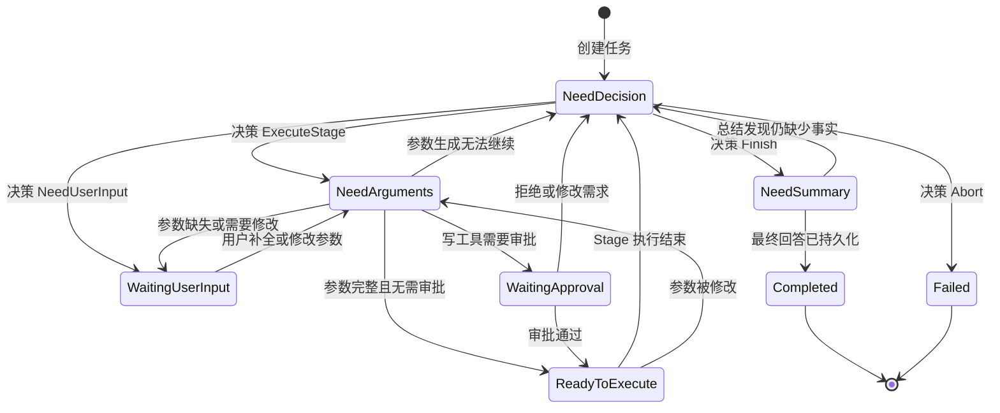
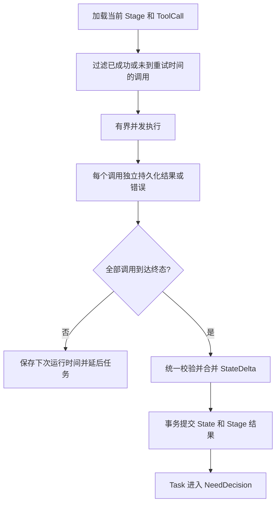

# Runtime 运行模型

## 1. 职责边界

`Runtime::handle` 每次只推进一个持久化 Phase。它不负责在一次调用中循环到任务最终完成。

建议的概念接口如下：

```rust
pub async fn handle(
    &self,
    job: RuntimeJob,
) -> Result<HandleOutcome, RuntimeError>;
```

其中：

```rust
pub struct RuntimeJob {
    pub task_id: TaskId,
    pub expected_phase: TaskPhase,
    pub expected_version: u64,
}

pub enum HandleOutcome {
    PhaseAdvanced,
    Deferred,
    Suspended,
    Completed,
    Failed,
    Stale,
}
```

`expected_phase` 和 `expected_version` 用于识别重复或过期的队列消息。任务实际状态已经变化时，`handle` 返回 `Stale`，不得重复执行旧 Phase。

## 2. Phase 分发

`handle` 只负责认领当前 Phase，并将工作委派给对应的 Phase Handler：

```rust
match task.phase {
    TaskPhase::NeedDecision => decision_handler.handle(context).await,
    TaskPhase::NeedArguments => argument_handler.handle(context).await,
    TaskPhase::ReadyToExecute => execution_handler.handle(context).await,
    TaskPhase::NeedSummary => summary_handler.handle(context).await,
    TaskPhase::WaitingUserInput
    | TaskPhase::WaitingApproval
    | TaskPhase::Completed
    | TaskPhase::Failed => HandleOutcome::Stale,
}
```

Phase Handler 之间不通过进程内临时对象传递关键结果。每个 Phase 的输出必须先持久化，后续 Phase 再从数据库读取。

## 3. Task Phase 状态机



Task 应独立保存业务 Phase 和调度状态，避免将两类状态混在一个枚举中：

```rust
pub enum SchedulingStatus {
    Ready,
    Queued,
    Running,
    Suspended,
    Terminal,
}
```

## 4. 决策 Phase

决策 Phase 根据用户目标、当前 State、业务知识、历史执行结果和候选工具，输出下一步动作。

```rust
pub enum Decision {
    ExecuteStage {
        calls: Vec<PlannedToolCall>,
    },
    Finish,
    NeedUserInput {
        message: String,
    },
    Abort {
        reason: String,
    },
}
```

`PlannedToolCall` 只描述工具选择和本次调用的目的，不包含最终参数：

```rust
pub struct PlannedToolCall {
    pub call_key: String,
    pub tool_name: String,
    pub purpose: String,
}
```

决策结果必须经过以下校验：

- 输出结构符合 Schema。
- 工具存在且用户有权限使用。
- 工具当前可调用。
- 同一 Stage 内的 ToolCall 不依赖彼此的输出。
- 同一 Stage 内不存在已知资源读写冲突。
- Stage 大小没有超过配置上限。

校验成功后，Runtime 在一个事务中持久化 Stage、PlannedToolCall 和 Phase 迁移。已经持久化的决策不得再次调用 LLM 生成。

## 5. 参数生成 Phase

参数生成 Phase 为 Stage 中尚未生成有效参数的 PlannedToolCall 生成参数。

基本规则：

- 所有参数都基于同一个 State 版本生成。
- 每个 ToolCall 的有效参数独立持久化。
- 已经持久化并通过校验的参数不得重新生成。
- 一个 ToolCall 的参数失败，不应导致其他已成功参数被重新生成。
- 参数需要用户补全时，保存当前草稿、缺失字段和原因，并进入 `WaitingUserInput`。
- 写工具需要审批时，完整参数持久化后进入 `WaitingApproval`。

参数校验至少包括：

- JSON 和 Schema 校验。
- 必填字段、类型、范围和格式校验。
- 未知字段校验。
- 权限和业务前置条件校验。
- 工具针对当前 State 的可调用性校验。

参数被用户修改后必须创建新 revision（修订版本）。旧审批自动失效，旧 revision 不得执行。

## 6. 工具执行 Phase

执行 Phase 加载当前 Stage 中尚未成功的 ToolCall，并通过有界执行器并发执行。详细的并行、重试和 StateDelta 规则见[工具执行](tool-execution.md)。



执行 Phase 可以在 Rust 异步任务中等待当前 Stage 的 ToolCall 完成。`await` 不会让 OS 线程空转，也不要求把 Phase 拆成回调事件链。

## 7. 最终总结 Phase

决策 Phase 返回 `Finish` 后，Task 进入 `NeedSummary`。总结 Phase 根据用户目标和已经持久化的 State 生成最终回答。

规则如下：

- 最终回答只能依据持久化 State 和执行记录中的事实。
- 生成成功后将回答持久化，再将 Task 标记为 `Completed`。
- 已经持久化的最终回答不得重新生成。
- 如果总结阶段确定仍缺少完成任务所需的事实，可以返回 `NeedDecision`，但必须记录原因并受循环上限约束。

## 8. Phase 通用规则

每个 Phase Handler 都必须满足：

1. 使用 Task Phase 和 version 原子认领当前工作。
2. 读取当前 Phase 所需的持久化输入。
3. 复用已经存在且有效的阶段输出。
4. 执行当前 Phase 唯一的非确定性或副作用操作。
5. 在同一事务中保存输出并推进到下一个 Phase。
6. Phase 完成后发送 Dispatcher 唤醒信号；通知丢失由数据库扫描恢复。

Phase 的纯校验、解析和对象转换属于当前 Handler 内部实现，不需要再拆成独立持久化 Phase。

## 9. 失败与终态

- LLM 或基础设施的临时错误可以延后当前 Phase，不推进状态。
- 参数无法生成时可以进入人工输入状态，或带着失败事实回到决策。
- Stage 失败后回到决策，不直接将 Task 标记为失败。
- 只有决策明确返回 `Abort`，或者 Task 达到不可恢复的硬限制，才进入 `Failed`。
- `Completed` 和 `Failed` 都是不可由 Dispatcher 自动恢复的终态。

更完整的失败分类见[运行保障](operations.md)。
