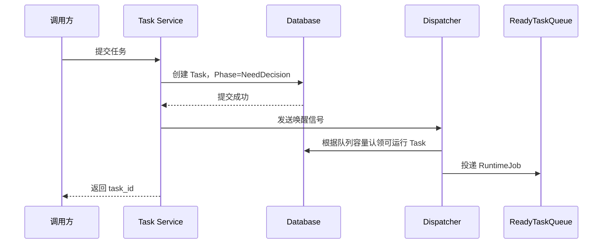
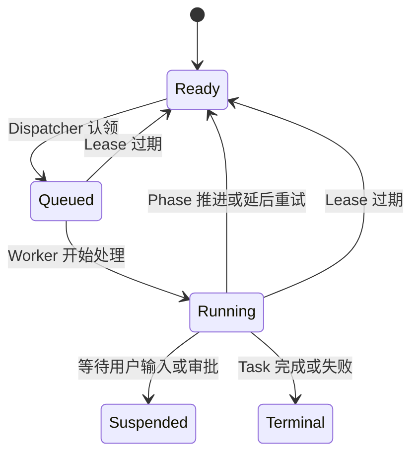

# 调度模型

## 1. 设计目标

调度层负责将数据库中的可运行 Task 交给 Worker，同时满足：

- 任务先持久化，进程崩溃后不丢失。
- 有界队列提供背压，避免内存和并发失控。
- 重复投递不会导致同一个 Phase 重复提交。
- 多实例可以安全认领任务。
- 通知降低正常延迟，数据库扫描保证最终恢复。

数据库是任务状态的唯一事实来源。内存队列只保存可恢复的 `RuntimeJob`，不保存唯一状态。

## 2. 调度组件

| 组件 | 职责 |
| --- | --- |
| Task Service | 持久化新任务，并发送 Dispatcher 唤醒信号。 |
| Dispatcher | 根据数据库状态和队列容量认领可运行任务。 |
| ReadyTaskQueue | 保存有界数量的 `RuntimeJob`，提供进程内背压。 |
| Worker Pool | 消费 `RuntimeJob` 并调用 `Runtime::handle`。 |
| Lease Manager | 维护运行中任务的租约和心跳。 |

## 3. 任务提交



任务必须先持久化，再进入内存队列。写入数据库失败时不得入队。

新任务写入后不由 Task Service 直接操作 ReadyTaskQueue。所有数据库认领和入队由 Dispatcher 统一负责，避免 Task Service 与周期扫描同时投递同一任务。

## 4. Dispatcher

Dispatcher 同时使用两种触发方式：

- 新任务或 Phase 完成时发送唤醒信号，降低正常延迟。
- 默认每秒扫描一次数据库，恢复丢失通知和进程重启前的任务。

唤醒信号只表达“可能有工作”，不承载 Task 的权威数据。Dispatcher 收到通知后仍然从数据库查询并认领任务。

Dispatcher 只根据有界队列的可用容量认领相应数量的任务。多实例环境中应使用数据库行锁或等价机制避免重复认领，例如 PostgreSQL 的 `FOR UPDATE SKIP LOCKED`。

建议的 `RuntimeJob` 如下：

```rust
pub struct RuntimeJob {
    pub task_id: TaskId,
    pub expected_phase: TaskPhase,
    pub expected_version: u64,
}
```

`RuntimeJob` 不携带完整 State。Worker 执行前必须从 Repository 读取最新状态。

## 5. 调度状态

业务 Phase 和调度状态是两个正交维度：

```rust
pub enum SchedulingStatus {
    Ready,
    Queued,
    Running,
    Suspended,
    Terminal,
}
```



调度状态只描述 Task 是否可被 Worker 处理，不表达当前业务步骤。业务步骤由 `TaskPhase` 表达。

## 6. Lease 与认领

认领任务时至少记录：

- `lease_owner`
- `lease_expires_at`
- `expected_phase`
- `expected_version`

Worker 执行较长 Phase 时定期续租。Lease 过期后，其他 Worker 可以重新认领任务。

Phase 开始时使用 CAS（Compare-And-Swap，比较并交换）验证 Phase 和 version。队列消息已经过期时，Worker 返回 `Stale`，不得继续执行。

重复认领不会直接造成重复逻辑提交，因为：

- Phase 通过状态和版本进行 CAS 认领。
- 已持久化的 LLM 输出直接复用。
- 已成功的 ToolCall 不再执行。
- 未完成的写工具使用稳定幂等键恢复。

## 7. Worker 行为

Worker 从 ReadyTaskQueue 取得 `RuntimeJob` 后：

1. 验证 job 的 Phase 和 version。
2. 将调度状态从 `Queued` 原子更新为 `Running`。
3. 调用一次 `Runtime::handle`。
4. 根据 `HandleOutcome` 更新调度状态。
5. Phase 可继续运行时发送 Dispatcher 唤醒信号。
6. 无论是否成功发送通知，数据库中都必须已经存在可恢复状态。

HTTP 请求或客户端连接不得拥有 Worker 的生命周期。客户端断开不能取消已经认领的后台 Phase。

## 8. 背压与公平性

系统至少具有三层有界控制：

- ReadyTaskQueue 容量限制进程内待处理任务数量。
- Worker 并发限制同时推进的 Task 数量。
- Tool Executor 限制 ExecutionPlan 内和全局工具调用并发。

Dispatcher 不得先无限认领数据库任务再阻塞等待入队。它应先获得队列容量，再认领对应数量的 Task。

为了避免复杂 Task 长期占用资源，应设置单 Phase 超时、单 ExecutionPlan ToolCall 上限和 Task 总预算。长时间重试等待应通过 `next_run_at_ms` 释放 Worker，而不是长期占用 Worker 并发名额。

## 9. 优雅停机

进程收到停机信号后：

1. 停止 Dispatcher 认领新 Task。
2. 停止向 ReadyTaskQueue 写入。
3. 允许运行中的短 Phase 在限定时间内完成。
4. 超时后停止续租，让其他实例在 Lease 过期后恢复。
5. 不通过删除或强制改写数据库状态模拟完成。

## 10. 调度不变量

1. 未持久化的 Task 不得入队。
2. 队列满不会导致数据库中的 Task 丢失。
3. 同一个 Task Phase 同时最多有一个提交者。
4. 通知丢失不能阻止任务最终运行。
5. 重复通知和重复队列消息必须安全。
6. `Suspended` 和 `Terminal` Task 不得被自动认领。
