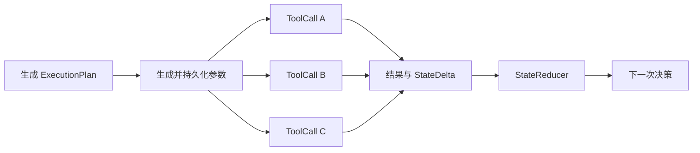

# 工具执行模型

## 1. ExecutionPlan 与 ToolCall

目标 Runtime 校验后的 ExecutionPlan 是一组可并行工具调用，也是结果统一进入 State 前的 barrier（屏障）单元。



一个 ExecutionPlan 中的 ToolCall 必须满足：

- 不需要读取同一 ExecutionPlan 中其他 ToolCall 的结果。
- 不存在 Runtime 已知的互斥资源写入。
- 所有调用都能基于同一 State 版本生成参数。

LLM 只能提出并行计划，Runtime 必须根据工具元数据做确定性校验，不能把 LLM 输出当作并发安全证明。

## 2. 工具元数据

工具元数据后续可包含：

```rust
pub struct ToolMetadata {
    pub side_effect: SideEffect,
    pub requires_approval: bool,
    pub read_resources: Vec<ResourcePattern>,
    pub write_resources: Vec<ResourcePattern>,
}
```

当前 `PhaseRuntime` 在创建计划时已实现保守校验：工具必须已注册；包含多个调用的计划只允许只读工具，写工具默认独占 `ExecutionPlan`。后续再扩展资源级冲突判断。

并发上限不属于 `ToolMetadata`：它取决于 Worker 容量、租户配额、外部限流和当前部署，应由执行器的运行时策略统一配置和实施，而不是由工具定义声明。

计划创建阶段校验并行安全，工具执行前仍需重新校验权限、参数 revision、业务前置条件和运行时并发限制。

## 3. 参数生成

参数生成 Phase 为 ExecutionPlan 中尚未生成有效参数的 ToolCall 生成参数。具体 Phase 迁移见[运行模型](runtime-model.md)。

参数生成遵循以下规则：

- 所有参数都基于 ExecutionPlan 记录的同一个 State 版本生成。
- 每个 ToolCall 参数独立持久化。
- 已经持久化并通过校验的参数不重新生成。
- 参数生成失败只影响对应 ToolCall，不清除其他有效参数。
- 参数修改创建新 revision，旧 revision 不得执行。

参数校验包括 JSON、Schema、字段、类型、范围、权限、业务前置条件和工具可调用性校验。

当前原型按单个 ToolCall 生成参数；目标架构是一次 LLM 调用生成整个 ExecutionPlan，还是按 ToolCall 分别调用，仍属于待决策项。无论选择哪种方式，都必须能够复用已经持久化的有效参数。

## 4. ToolCall 执行

执行 Phase 加载当前 ExecutionPlan 中尚未成功的 ToolCall，并通过有界执行器并发执行。

执行规则：

- 工具只读取 ExecutionPlan 开始时确定的 State 快照。
- 工具不得直接修改共享 State。
- 成功结果包含结构化输出和 StateDelta。
- 每个 ToolCall 完成后立即持久化，避免其他 ToolCall 失败时丢失成功结果。
- 执行 Phase 等待所有 ToolCall 成功、重试耗尽或进入无法确定状态。
- ExecutionPlan 结束后统一更新 State。
- 即使 ExecutionPlan 部分失败，成功结果和成功产生的 StateDelta 仍然保留。
- 重试耗尽只令 ExecutionPlan 失败；Task 进入 `NeedDecision`，由 LLM 决定下一步。

对于异步 I/O 工具，执行器应使用 Rust Future 的有界并发能力。CPU 密集型工具和阻塞 SDK 应分别使用计算线程池或阻塞线程池，不能阻塞 Tokio 执行线程。

## 5. ToolSuccess 与 StateDelta

目标工具接口应返回结构化结果：

```rust
pub struct ToolSuccess {
    pub output: serde_json::Value,
    pub state_delta: StateDelta,
}
```

当前代码将 `StateMutation` 表示为受限的 `Set` 和 `Remove` 操作集合。无论后续是否扩展操作类型，都必须满足：

- 可以在不重新执行工具的情况下重放。
- 可以检测同一 ExecutionPlan 内的冲突。
- 可以校验工具是否越权修改 State。
- 应用顺序确定且可审计。

每个 ToolCall 完成后只保存结果和建议的 StateDelta。工具本身不得持有 `&mut State`，也不得直接提交 State。

## 6. StateReducer

StateReducer 按稳定顺序合并 StateDelta，例如按 `plan.call_key` 或 ToolCall ID 排序。禁止使用并发完成顺序作为合并顺序。

ExecutionPlan 部分失败时：

- 应用所有无冲突的成功 StateDelta。
- 将失败工具、最终错误、尝试次数和失败分类写入执行事实。
- 将 ExecutionPlan 标记为失败。
- Task 进入 `NeedDecision`，不直接进入终态失败。

如果多个 StateDelta 发生冲突：

- 不采用最后写入覆盖。
- ToolCall 原始结果仍然保留。
- 冲突的 StateDelta 不自动应用。
- 记录 `StateReduceError::Conflict` 并令 ExecutionPlan 失败。
- 下一次决策根据工具结果和冲突事实决定如何继续。

State 和执行记录的持久化事务见[持久化与恢复](persistence-and-recovery.md)。

## 7. 重试模型

工具通过重试策略描述当前错误是否应该重试：

```rust
pub enum RetryDecision {
    RetryAfter { delay_ms: u64 },
    Stop,
}

pub trait ToolRetryPolicy {
    fn retry_decision(
        &self,
        error: &ToolError,
        attempt: u32,
    ) -> RetryDecision;
}
```

策略必须同时考虑错误类型和当前尝试次数：

| 错误类型 | 默认处理 |
| --- | --- |
| 参数或 Schema 错误 | 不使用相同参数重试，交回下一次决策。 |
| 权限和确定性业务错误 | 不重试，记录失败事实。 |
| 临时网络错误 | 按工具配置重试。 |
| 服务限流 | 根据服务建议或指数退避重试。 |
| 外部结果无法确认 | 标记为 `ExecutionUnknown`，不自动重复高风险写操作。 |

短时间退避可以在当前异步执行 Phase 内 `await`。较长退避应保存 `next_retry_at_ms`，释放 Worker，并在未来重新调度同一个执行 Phase。

## 8. at-least-once 与幂等

系统对队列和崩溃恢复采用 at-least-once 语义。不能只依赖“执行前标记 Running”实现 exactly-once，因为存在外部工具成功但本地结果尚未提交时进程崩溃的窗口。

每个写 ToolCall 使用稳定幂等键，建议由以下信息生成：

```text
task_id + execution_plan_id + tool_call_id + argument_revision
```

恢复时：

- ToolCall 已成功持久化：直接复用结果。
- ToolCall 尚未开始：正常执行。
- ToolCall 处于 Running 且 Lease 已过期：使用同一幂等键恢复执行。
- 外部系统不支持幂等且结果无法查询：进入 `ExecutionUnknown`，不得自动重复高风险操作。

LLM 调用也存在“响应已返回但尚未持久化时崩溃”的窗口。架构保证已持久化的 LLM 输出不再生成，但如果模型服务不支持请求幂等，则不能保证网络层调用严格只发生一次。

## 9. 人工参与

### 9.1 补全或修改参数

参数不足时保存：

- 当前参数草稿。
- 缺失或无效字段。
- 向用户提问的内容。
- 当前参数 revision。

用户修改参数后创建新 revision，重新执行确定性校验。已经针对旧 revision 作出的审批自动失效。

### 9.2 审批写工具

需要审批的工具在参数完整生成后进入 `WaitingApproval`。审批对象必须是具体且不可变的 ToolCall revision。

审批通过后执行已经持久化的参数，不得重新让 LLM 生成。拒绝审批或修改需求后，旧 ToolCall 失效，Task 回到决策或参数阶段。

第一版可以只持久化并返回等待状态，不实现用户恢复接口，但不得把等待状态误判为失败或完成。

## 10. 工具执行不变量

1. ExecutionPlan 中所有 ToolCall 使用同一 State 版本。
2. 已成功的 ToolCall 不重新执行。
3. 相同参数 revision 使用稳定幂等键。
4. 工具不直接修改共享 State。
5. 并发完成顺序不影响最终 State。
6. 部分失败不丢弃成功工具产生的事实。
7. 重试耗尽令 ExecutionPlan 失败，不直接令 Task 失败。
